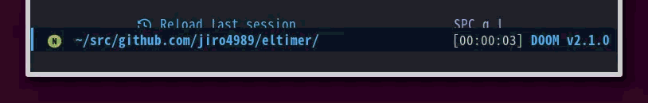

* eltimer

eltimer is a simple timer that operates on the mode line.
Entering strings like 1h, 2m, or 3s will display the time on the mode line.
When the time is up, it will beep and shut down.

** Installation

#+BEGIN_SRC emacs-lisp
(package! eltimer
  :recipe (:host github
           :repo "jiro4989/eltimer"
           :files ("src/*.el")))
#+END_SRC

** Usage

Call =eltimer-timer-start=.
